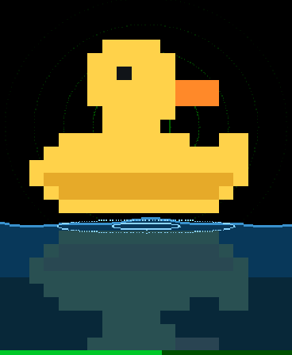
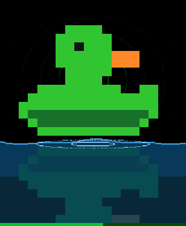
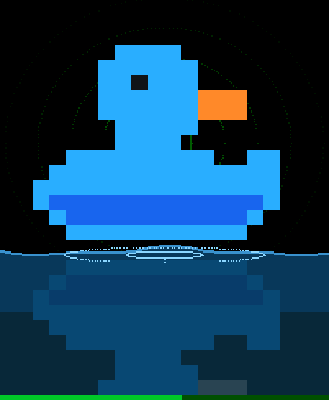
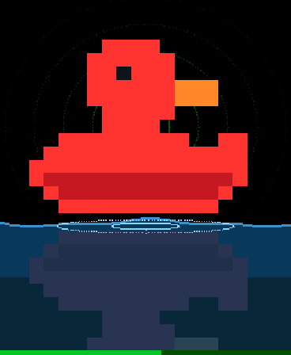
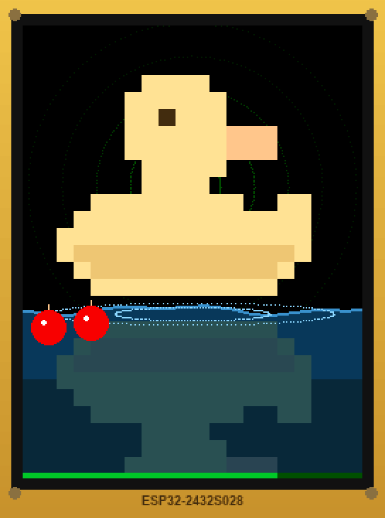
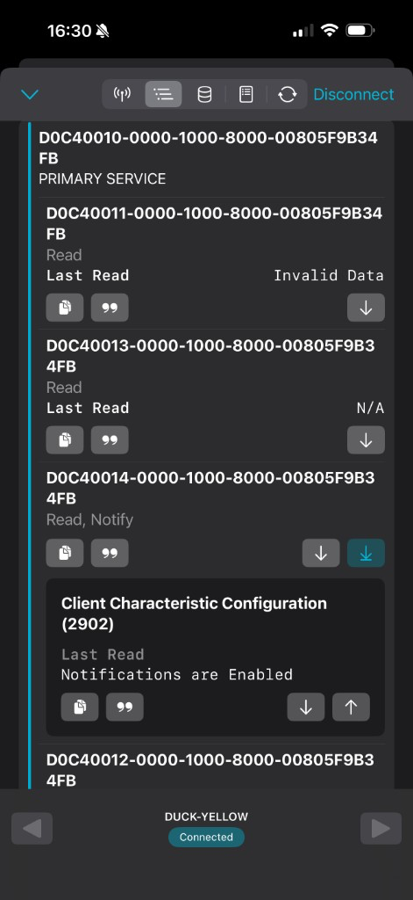

<p align="center">
  
  
  
  
</p>

<h1 align="center">Duck Hunt</h1>

<p align="center">
  <strong>BLE rubber-duck CTF</strong> for WiCyS workshops — hunt the pond, read the story, submit the keyword, claim the flag.
</p>

<p align="center">
  <a href="CYD/"></a>
  <a href="ESP32_S3/"></a>
  
  
</p>

---

## Hunt the pond

<p align="center">
  
</p>

Physical ducks advertise over Bluetooth Low Energy as `{Colour}-Duck-{N}`. Players use **nRF Connect** (not the phone’s system Bluetooth list) to open the duck service, read the story, write a keyword, and pull the flag.

| Target | Board | Folder |
|--------|--------|--------|
| **CYD** | ESP32-2432S028 · ILI9341 240×320 · resistive touch | [`CYD/`](CYD/) |
| **ESP32-S3 AMOLED** | Waveshare ESP32-S3-Touch-AMOLED-1.8 | [`ESP32_S3/`](ESP32_S3/) |

Each CYD unit is serialized (`CYD/duck_identity.h`) with **unique** stage keywords and flags — Duck-2 will not accept Duck-1’s answers.

Want your own keywords or `WiCyS{…}` strings for an event? Edit the firmware tables and reflash — see **[CUSTOMIZING.md](CUSTOMIZING.md)**. No on-device editor; GIFs do not need regenerating.

---

## Player flow

<p align="center">
  
</p>

1. Open **nRF Connect** → scan → connect to `{Colour}-Duck-{N}` (e.g. `Yellow-Duck-1`)
2. Read **STORY**
3. Write **SUBMIT** as **Text (UTF-8)**
4. Read **FLAG**
5. Change colour for stage 3 (see controls below)

Workshop handout: [`WiCyS_BLE_Talking_to_Ducks.html`](WiCyS_BLE_Talking_to_Ducks.html)

---

## Colour controls

| Board | Next colour | Previous colour |
|-------|-------------|-----------------|
| ESP32-S3 | BOOT | PWR (expander) |
| CYD | BOOT | Tap left edge of screen |

---

## Flashing CYDs

```bash
./flash_duck.py --list           # per-duck answer key
./flash_duck.py 3                # flash serial 3
./flash_duck.py --batch 1-8      # flash the flock
```

Admin on device: swipe left → ADMIN → PIN **`24650`**

| Menu | Action |
|------|--------|
| RESET BOBBERS | Clears bobbers on all colours |
| GAME 1 * | Round 1; broadcasts to other ducks ~20s |
| GAME 2 * | Round 2; broadcasts to other ducks ~20s |
| DONE | Exit |

After flash: swipe → 3-cross touch cal → admin PIN.

### Serial shortcuts

`1` / `2` = set game + broadcast · `A` = admin · `R` = reset progress · `N`/`P` = colour

---

## Build notes

**CYD** — Arduino *ESP32 Dev Module*, Huge APP, upload 115200, LovyanGFX. Edit `CYD/duck_identity.h` for the unit number:

```bash
arduino-cli compile --fqbn 'esp32:esp32:esp32:PartitionScheme=huge_app,FlashFreq=80,FlashMode=qio,FlashSize=4M,UploadSpeed=115200' CYD
```

**ESP32-S3** — Waveshare FQBN (16MB, OPI PSRAM, CDC) with the board’s vendor GFX stack.

---

## Rounds (example: Duck-1)

**Game 1:** `QUACK` → `POND` (`UE9ORA==`) → **YELLOW** + `HOME`  
Flags: `WiCyS{d01_g1_quack}` / `{d01_g1_pond}` / `{d01_g1_home}`

**Game 2:** `WADDLE` → `BREAD` (`QlJFQUQ=`) → **GREEN** + `NEST`  
Flags: `WiCyS{d01_g2_waddle}` / `{d01_g2_bread}` / `{d01_g2_nest}`

Other serials use different keywords (see `CYD/CYD.ino` `GAMES_BY_DUCK`).

---

## Layout

```
CYD/                          Cheap Yellow Display firmware
ESP32_S3/                     AMOLED 1.8" firmware
assets/                       Duck screens + nRF Connect mockups
flash_duck.py                 Per-serial compile & flash
WiCyS_BLE_Talking_to_Ducks.html
```

---

<p align="center">
  <sub>WiCyS · BLE · ESP32</sub>
</p>
